#  机器学习

[TOC]

## 00 绪论

### 00.1 基本术语

数据集：记录的集合

示例/样本：关于一个事件或对象的描述

属性/特征：反映事件或对象在某方面的表现或性质的事项

属性空间/样本空间/输入空间：属性张成的空间

特征向量：对象在这个空间中的坐标位置

D包含m个示例的数据集，每个示例由d个属性描述，则d被称为样本的维数

学习/训练：从数据中学得模型的过程

训练数据：训练过程中使用的数据

训练样本：其中的每个样本

训练集：训练样本组成的集合

模型：“学习器”，看作学习算法在给定数据和参数空间上的实例化

标记：关于示例结果的信息

样例：拥有了标记信息的示例

标记空间/输出空间：所有标记的集合

分类：对于离散值的预测任务

回归：对于连续值的预测任务

监督学习/无监督学习：训练数据是否拥有标记信息

### 00.2 假设空间

归纳：从特殊到一般的泛化过程，即从具体的事实归结出一般性的规律

演绎：从基础原理推演出具体状况

### 00.3 归纳偏好

归纳偏好：机器学习算法在学习过程中对某种类型假设的偏好

没有免费的午餐 定理：

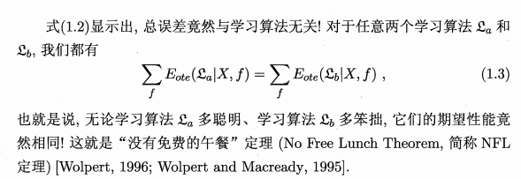

我们只关注自己正在试图解决的问题（某个具体应用任务），NFL定理是让我们清楚地认识到脱离具体问题，空谈什么学习算法更好毫无意义。

如果考虑所有潜在的问题，则所有学习算法一样好，要谈论算法的相对优劣，必须针对具体的学习问题。

### 00.4 学习方法

统计学习方法都是由 模型、策略和算法 构成的

#### 00.4.1 模型

模型是所要学习的条件概率分布或决策函数。

模型的假设空间包含**所有可能的**条件概率分布或决策函数。

* 假设空间定义为条件概率的集合

  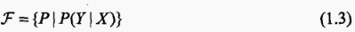

* 定义为一个参数向量决定的条件概率分布族

  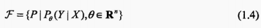

* 假设空间定义为决策函数的集合

  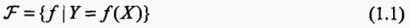

* 定义为一个参数向量决定的函数族

  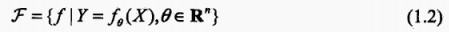

#### 00.4.2 策略

监督学习对于给定的输入，在假设空间中选取模型f作为决策函数输出相应的真实值Y。而这个真实值Y于与f可能会不一致。

利用损失函数(loss function)或代价函数(cost function)来度量预测的错误程度。

* 损失函数

  f(X) 和 Y 的非负实值函数，损失函数值越小，模型就越好：

  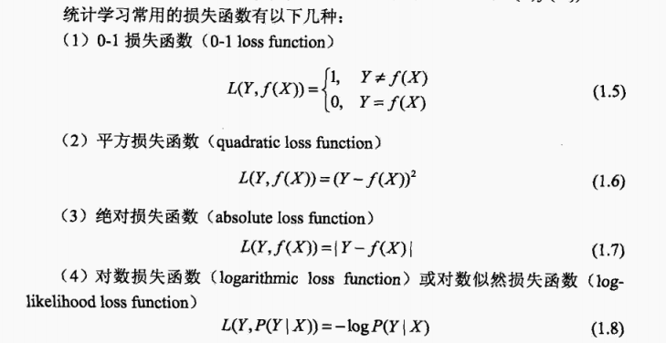

* 损失函数的期望（风险函数、期望损失）

  理论上模型 f(X) 关于联合分布P(X, Y) 的平均意义下的损失：

  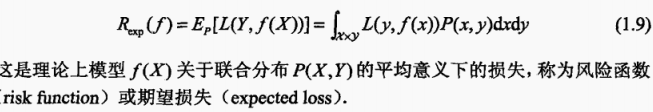

因为不知道联合概率分布，所以常使用经验风险：

来估计期望风险。但现实中训练样本有限，所以用经验风险预估往往不太理想，需要对经验风险进行矫正。

* 结构风险最小化

  系数lambda用以权衡经验风险和模型复杂度：

  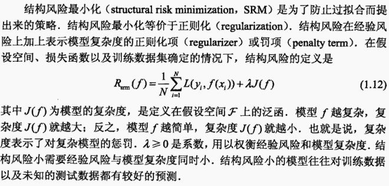

## 01 模型的评估与选择

### 01.1 经验误差与过拟合

错误率：分类错误的样本数占总样本总数的比例

精度 = 1 - 错误率

误差：学习器的实际预测输出与样本的真实输出之间的差异

训练误差：学习器在训练集上的误差

泛化误差：学习器在新样本上的误差

过拟合：学习器把训练样本学得太好了的时候，很可能已经把训练样本自身的一些特点当作了所有潜在样本都会具有的一般性质，这样就会导致泛化性能下降

欠拟合：学习器对训练样本的一般性质尚未学好

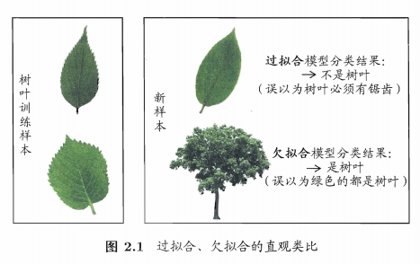

#### 01.1.1 过拟合和模型选择

* 对过拟合的解释：

  给定数据集：

  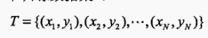

  用高次多项式对该数据集的数据进行拟合：

  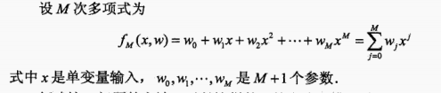

  给定经验风险最小化：

  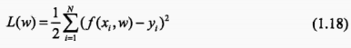

  将数据集带入，并令其偏导数为0求其参数：

  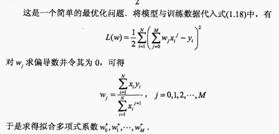

  得到M次多项式函数的拟合图像：

  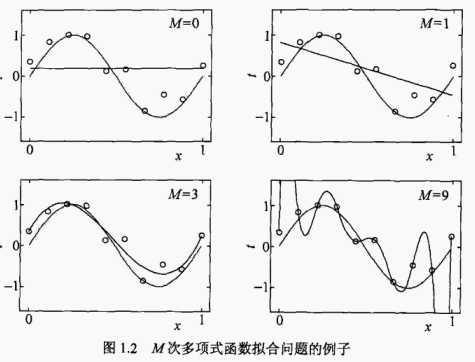

  对于上图拟合结果：

  * M=0 时多项式曲线是一个常数，数据拟合效果很差
  * M=9 时多项式曲线通过每个数据点，从数据拟合的角度来说，效果是最好的。但这种训练数据本身存在噪声，拟合曲线对**未知数据**的预测能力往往不是最好的
  * M=3 时多项式曲线对训练数据拟合效果足够好，模型也比较简单，是一个较好的选择

  因此，在实际学习的模型选时，不仅要考虑对已知数据的预测能力，而且还要考虑对未知数据的预测能力。

* 训练误差与测试误差

  随着多项式次数（模型复杂度）的增加，训练误差会减小，直至趋向于0。而测试误差会先减小而后增大。

  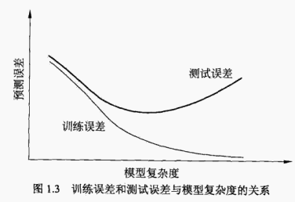

  应选择复杂度适当的模型，以达到使测试误差最小的学习目的。

### 01.2 模型选择时的评估方法

测试集：测试学习器对新样本的判别能力，然后以测试集上的测试误差作为泛化误差的近似。测试集应该经尽可能与训练集互斥，即测试样本尽量不在训练集中出现、未在训练过程中使用该

* 留出法

  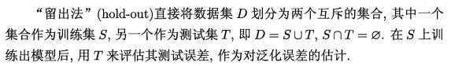

* 交叉验证法

  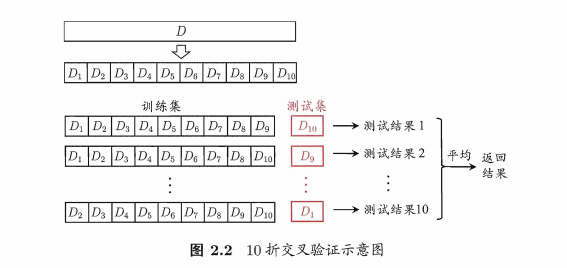

* 自助法

  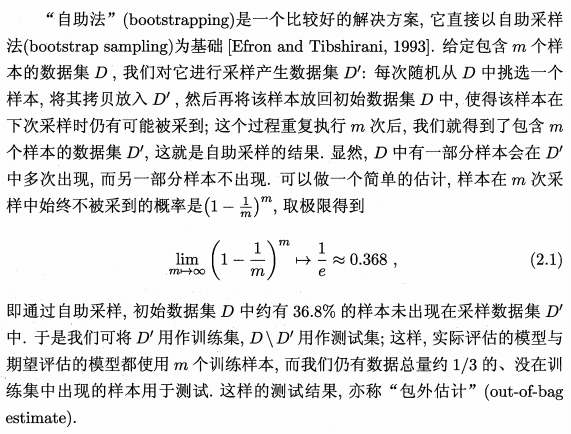

调参：在进行模型评估与选择时，需要对算法参数进行设定

验证集：把学得模型在实际使用中遇到的数据称为测试数据

### 01.3 性能度量

* 均方误差

  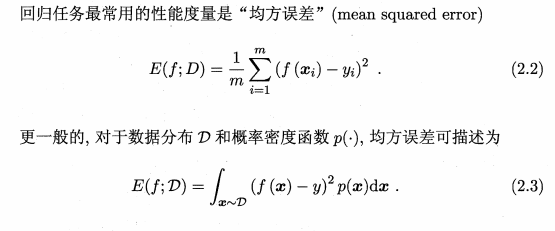

* 错误率与精度

  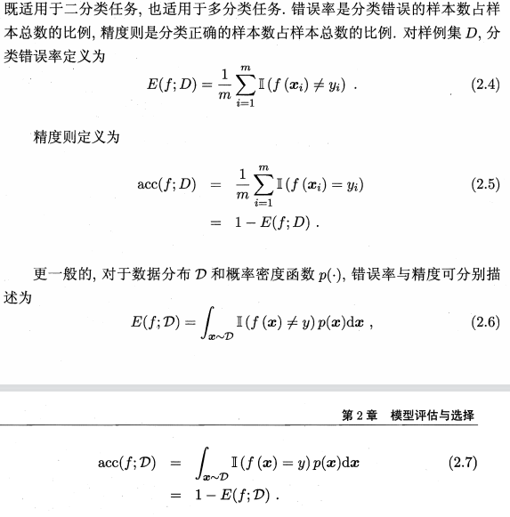

* 查准率、查全率

  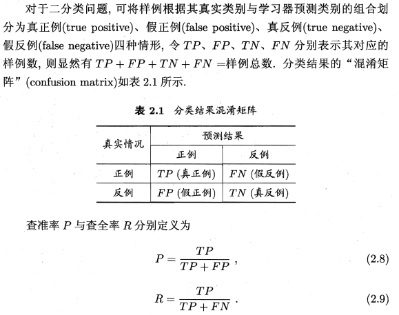

  平衡点：查准率 = 查全率

  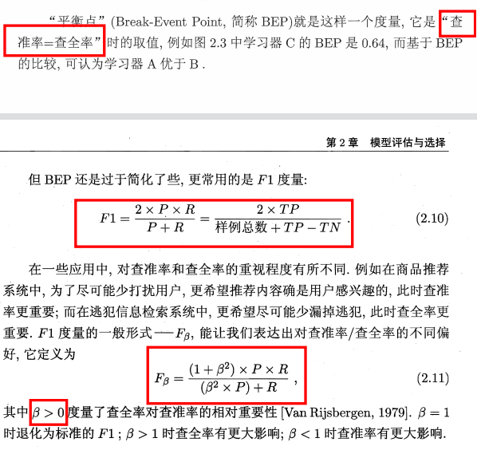

* ROC与AUC

  ROC：受试者工作特征

  

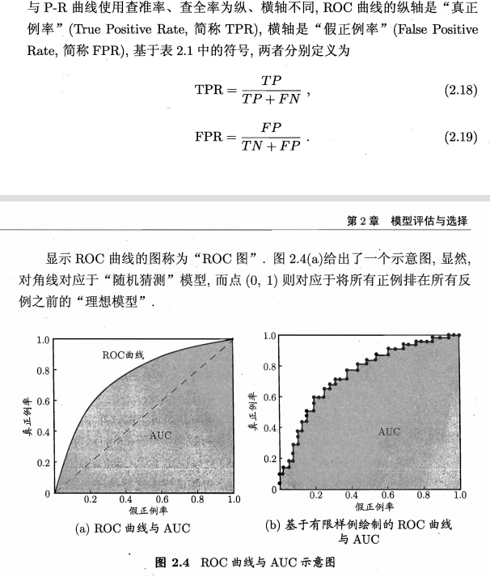

​	AUC：ROC曲线下的面积

​	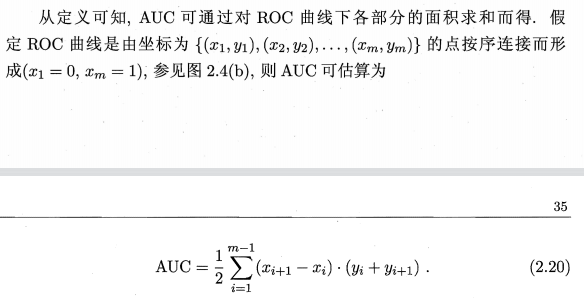

### 01.4 比较检验

* 假设检验 假设学习器泛化错误率是e0

  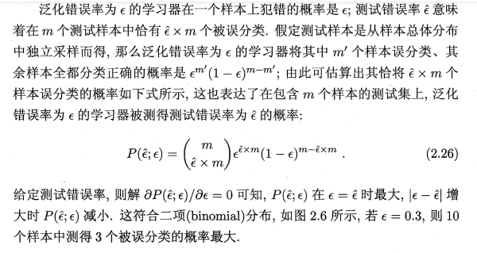

* 交叉验证t检验

  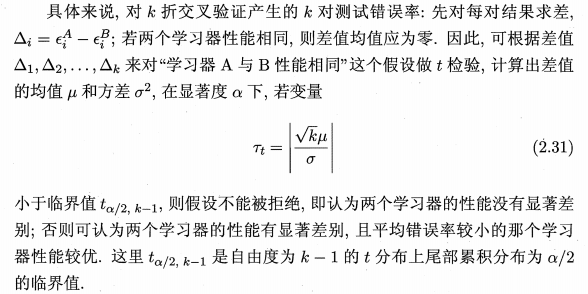

* McNemar检验 

  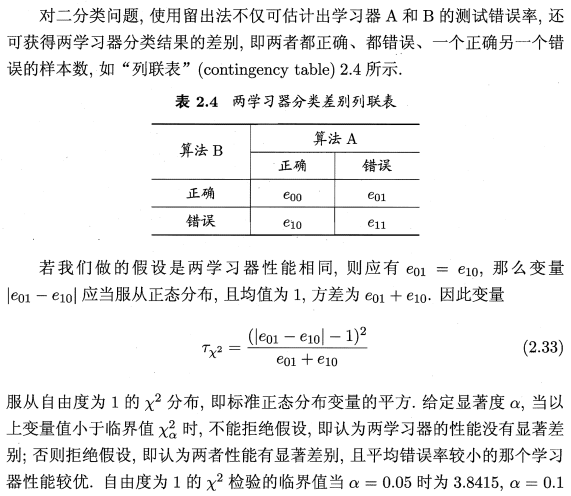

### 01.5 偏差与方差

* 方差

  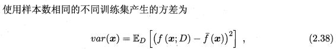

* 偏差

  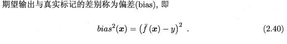

* 噪声

  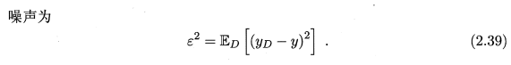

* 假定噪声为0，将泛化误差分解为偏差与方差的表达式

  

##  02 线性模型

### 02.1 基本形式

试图学得一个通过属性的线性组合来进行预测的函数。

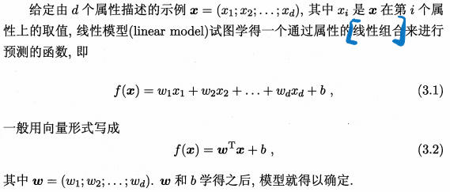

### 02.2 线性回归

线性回归：试图学得一个线性模型以尽可能准确地预测实值输出标记

* 线性回归

线性回归试图学得：

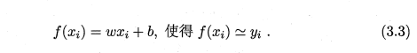

利用均方误差作为性能度量：

求导将均方误差最小化：

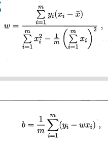

* 多元线性回归

对于数据集D，样本由d个属性描述，则试图学得：

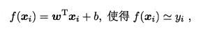

将示例作为一行组成矩阵X，其中每行的前d个元素表示d个属性值：

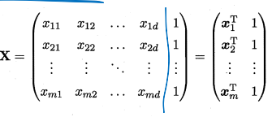

可求得系数w的最优解（XTX为满秩矩阵或正定矩阵时）：

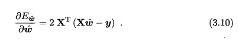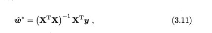

* 对数线性回归

假设示例所对应的输出标记是在指数尺度上变化，以对数作为线性模型逼近的目标：

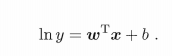

### 02.3 对数几率回归

对于分类任务，只需找一个单调可微函数将分类任务的真实标记y与线性回归模型的预测值联系起来。

* 单位阶跃函数

  考虑二分类任务，将z转换为0/1值：

  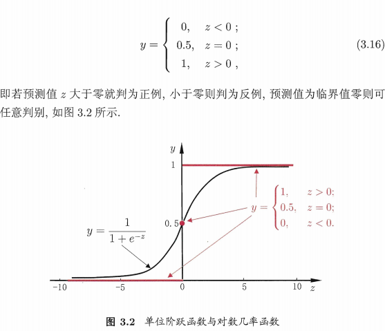

* 对数几率函数

  作为近似单位阶跃函数的替代函数

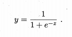

​		Sigmoid函数：在z=0附近变化很陡，带入转换后可得：

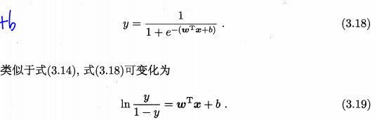

​		其中，对数几率可表现为

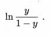

​		该 对数几率回归 模型可用作近似概率预测和求取最优解

用“极大似然法”估计w和b：

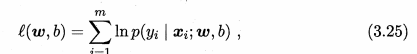

用p0和p1重写似然项：

用牛顿法迭代得最优解：

#### 极大似然估计

[极大似然估计](https://blog.csdn.net/zengxiantao1994/article/details/72787849?ops_request_misc=%257B%2522request%255Fid%2522%253A%2522164273721516780271527338%2522%252C%2522scm%2522%253A%252220140713.130102334..%2522%257D&request_id=164273721516780271527338&biz_id=0&utm_medium=distribute.pc_search_result.none-task-blog-2~all~sobaiduend~default-1-72787849.first_rank_v2_pc_rank_v29&utm_term=%E6%9E%81%E5%A4%A7%E4%BC%BC%E7%84%B6%E6%B3%95&spm=1018.2226.3001.4187)

### 02.4 多分类学习

将二分类学习方法直接推广到多分类。先对问题进行拆分，然后为拆分出的每个二分类任务训练一个分类器；在测试时，对这些分类器的预测结果进行集成以获得最终的分类结果。

## 03 决策树

### 03.1 基本流程

一个根结点->若干个内部结点+若干个叶结点

叶结点 = 决策结果

其他结点 = 属性测试

* 决策树学习基本算法：

  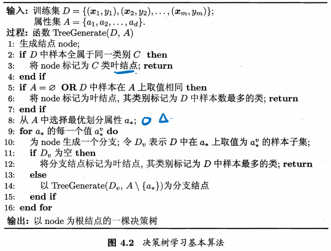

  递归返回的情景：

  * 当前结点包含的样本全属于同一类别
  * 当前属性集为空，或是所有样本在所有属性上取值相同
  * 当前结点包含的样本集合为空

### 03.2 划分选择

* 信息增益

  信息熵：度量样本集合纯度最常用的一种指标

  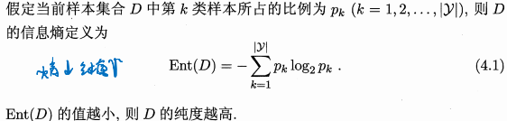
  
  
  
  信息增益：给分支结点赋予权重，计算出样本数有关的分支结点影响
  
  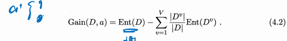

* 增益率：选择最优化分属性

  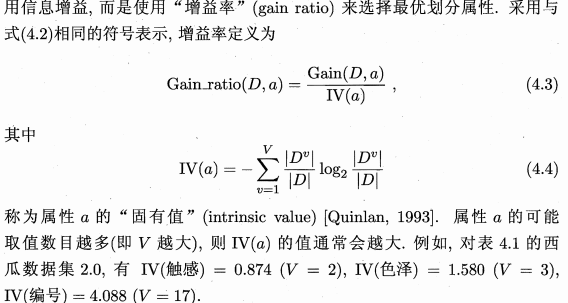

* 基尼指数

  基尼值：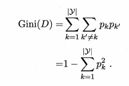

  用4.2 的形式来表示基尼指数：

  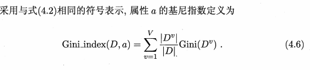

### 03.3 剪枝处理

剪枝：防止把训练集自身的一些特点当作所有数据都具有的一般性质而过拟合，所以 主动去掉一些分支来降低过拟合的风险

* 预剪枝

  在决策树生成过程中，对每个结点在划分前进行估计，若当前结点的划分不能带来决策树泛化性能提升，则停止划分并将当前结点标记为叶结点

  有些分支的当前划分虽不能提升泛化性能、甚至可能导致泛化性能暂时下降，但在其基础上进行的后续划分却有可能导致性能显著提高

* 后剪枝

  先从训练集生成一棵完整的决策树，然后自底向上地对非叶结点进行考察，若将该结点对应的子树替换为叶结点能带来决策树泛化性能提升，则将该子树替换为叶结点 

  将结点替换为叶结点自顶向下考察，其训练时间开销比未剪枝决策树和预剪枝决策树都要大得多

### 03.4 连续与缺失值

* 连续值处理

  选取区间中位点作为划分点

  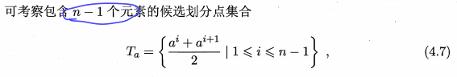

  选取最优划分点进行样本集合的划分：

  

* 缺失值处理

  为样本赋予权重，定义相关比例：

  

    推广信息增益的计算式：

  

  从而将同一样本以不同的概率划入到不同的子结点去：

  

### 03.5 多变量决策树

对于多变量决策树，非叶结点不再是仅对某个属性，而是对属性的线性组合进行测试。不是为每个非叶结点寻找一个最优划分属性，而是试图建立一个合适的线性分类器。

### 03.6 决策树模型与学习

#### 03.6.1 决策树模型

* 决策树：分类决策树模型是一种描述对实例进行分类的树形结构，决策树有**结点**和**有向边**组成。

  结点有两种类型：内部结点和叶结点。内部结点表示一个特征或属性，叶结点表示一个类

#### 03.6.2 决策树与if - then 规则

* 由决策树的根结点到叶结点的每一条路径构建一条规则；

* 路径上内部结点的特征对应着规则的条件，而叶结点的类对应着规则的结论。

* 每一个实例都被一条路径或一条规则所覆盖，而且只被一条路径或一条规则所覆盖。

#### 03.6.3 决策树与条件概率分布

决策树可以表示给定特征条件下类的条件概率。

* 该条件概率分布定义在特征空间的一个划分上，**将特征空间划分为互不相交的单元或区域**，并**在每个单元定义一个类的概率分布**就构成了一个条件概率分布。
* 决策树的一条路径对应划分的一个单元。
* 决策树表示的条件概率分布由各个单元给定条件下类的条件分布组成。
* 各叶结点上的条件概率往往偏向某一个类，即属于某一类的概率较大。决策树分类时将该结点的实例强行分到条件概率大的那一类去。

#### 03.6.4 决策树学习

决策树学习的算法是一个**递归地选择最优特征，并根据该特征对训练数据进行分割**，使得对各个子数据集有一个最好的分类过程。这一过程对应着对特征空间的划分，也对应着决策树的构建。

* 构建根节点，将所有训练数据都放在根节点
* 选择一个最优特征，按照这一特征将训练数据集分割成子集，使得各个子集有一个在当前条件下最好的分类
* 如果这些子集已经能够被基本正确分类，那么构建叶结点，并将这些子集分到所对应的叶结点中去
* 如果还有子集不能被基本正确分类，那么就对这些子集选择新的最优特征，继续对其进行分割，构建相应的结点
* 如此递归地进行下去，直至所有的训练数据子集被基本正确分类，或者没有合适的特征位置

该决策树可能对训练数据有很好的分类能力，但对位置的测试数据未必有很好的分类能力，可能产生过拟合的现象。需要进行剪枝处理。

### 03.7 决策树的特征选择

选取对训练数据具有分类能力的特征，可以提高决策树学习的效率。

* 随机变量 X 的熵定义为：

  

  因为熵不依赖于X，可以用X的分布来表示：

  

  可知熵随概率p变化的曲线为：

  

* 条件熵

  X 给定条件下Y 的条件概率分布的熵对X 的数学期望。用来表示在已知随机变量X 的条件下随机变量Y 的不确定性：

  

* 信息增益

  表示得知特征X 的信息而使得类Y 的信息不确定性减少的程度。

  * 给定训练数据集D 和特征A 。经验熵H(D) 表示**对数据集D 进行分类的不确定性**。经验条件熵H(D|A) 表示**在特征A 给定条件下对数据集D 进行分类的不确定性**。它们的差表示的就是 信息增益。

    

    信息增益依赖于特征A 的选择，其选择的方法是：对训练数据集D，计算其每个特征的信息增益，并比较它们的大小，选择信息增益最大的特征。

  * 算法过程：

    计算D的经验熵 H(D):

    

    计算经验条件熵H(D |A):

    

    计算信息增益：

    

* 信息增益比

  信息增益的大小是相对于训练数据集而言的。在分类问题困难时，即在训练集的**经验熵**大的时候，信息增益值会偏大，反之会偏小。

  * 定义：信息增益g(D, A)与训练数据集D的经验熵H(D) 之比：

    

### 03.8 决策树的生成算法

#### 03.8.1 ID3算法

* 从根结点开始，对结点计算所有可能的特征的信息增益。

* 选择信息增益最大的特征作为结点的特征。
* 由该特征的不同取值建立子结点
* 再对子结点递归地调用以上方法，构建决策树
* 直到所有特征的信息增益均很小或没有特征可以选择为止，最后得到一个决策树

**ID3算法只有树的生成，所以该算法生成的树容易产生过拟合。**

#### 03.8.2 C4.5算法

C4.5 算法是对ID3 算法的改进，用**信息增益比**来选择特征。

### 03.9 决策树的剪枝算法

剪枝从已生成的树上裁掉一些子树或叶结点，并将其根结点或父结点作为新的叶结点，从而简化分类树模型。

通过**极小化决策树整体损失函数或代价函数**来实现：

* 决策树学习的损失函数：

  

  

* 经验熵：

  

* 将第一项记作 C(T)：

  

* 其中C(T) = 

  

对于损失函数的分析有：

​		|T|代表了叶结点的个数，即模型的复杂度，参数a控制两者之间的影响，较大的a促使选择较简单的模型，较小的a促使选择较复杂的模型，a = 0只考虑模型和训练数据的拟合程度，不考虑模型的复杂度。

* 剪枝：当a确定时，选择损失函数最小的模型，即损失函数最小的子树。
* 决策树生成只考虑了**通过提高信息增益对训练数据进行更好的拟合**。
* 决策树剪枝**通过优化损失函数还考虑了减小模型复杂度。**

#### 03.9.1 剪枝算法

* 树的剪枝算法

  

### 03.10 CART算法

CART由特征选择、树的生成级剪枝组成。其在**给定输入随机变量X 条件下输出随机变量Y 的条件概率分布**的学习方法。

* 递归地二分每个特征
* 将特征空间划分为有限个单元
* 在这些单元上确定预测的概率分布，即在输入给定的条件下输出的条件概率分布

#### 03.10.1 CART生成算法

递归地构建二叉决策树的过程。

* 对回归树用平方误差最小化准则
* 对分类树用基尼指数最小化准则

进行特征选择，生成二叉树。

##### 03.10.1.1 回归树的生成

一个回归树对应着特征空间的一个划分以及在划分的单元上的输出值。

* 给定训练数据集D，假设已将输入控件划分为M 个单元R1、R2...Rm

  上有一个固定的输出值Cm，则回归树模型可表示为：

  

* 采用启发式的方法，对输入空间进行划分。将第j 个变量x 作为**切分变量**，它的取值s作为**切分点**，并定义两个区域：

  

* 用下式固定输入变量j 确定最优切分点s：

  

   

* 用该点(j, s)将输入空间划分为两个区域。接着每个区域重复上述划分过程，直到满足停止条件为止。

* 最小二乘回归树生成算法：

  

##### 03.10.1.2 分类树的生成

用基尼指数选择最优特征，同时决定该特征的最优二值切分点。

* 基尼指数

  Gini(D) 表示集合D的不确定性

  Gini(D,A) 表示经A = a 分割后集合D 的不确定性

  **基尼指数值越大，样本集合的不确定性也就越大。**

  

  * 二分类问题：两个类，一个类为P，一个类 1 - P：

    

  * 给定样本集合D，k类中样本子集Ck：

    

  * 当样本集合D被分为D1和D2两个部分：

    

#### 03.10.2 CART剪枝算法

从“完全生长”的决策树的底端剪去一些子树，使决策树变小（模型变简单），从而能够对未知数据有更准确的预测。

* 从生成算法产生的决策树T0底端开始不断剪枝，直到T0的根结点，形成一个子树序列。
* 通过交叉验证法在独立的验证数据集上对子树序列进行测试，从中选择最优子树。

## 04 神经网络

神经网络是由具有适应性的简单单元组成的广泛并行互连的网络，它的组织能够模拟生物神经系统对真实世界物体所作出的交互反应。

### 04.1 神经元模型

* 生物神经网络中，每个神经元与其他神经元相连，当它兴奋时，就会向相连的神经元发送化学物质，从而改变这些神经元内的点位。如果某神经元的电位超过了一个阈值，那么它就会被激活，即兴奋起来，向其他神经元发送化学物质。

* M-P神经元模型：神经元接收到来自n个其他神经元传递过来的输入信号，这些输入信号通过带权重的连接进行传递，神经元接收到的总输入值将与神经元的阈值进行比较，通过“激活函数”处理以产生神经元的输出：

  

* 激活函数

  阶跃函数：不连续不光滑

  Sigmoid函数：把可能在较大范围内变化的输入值挤压到(0, 1)输出值范围内

  

### 04.2 感知机与多层网络

* 感知机

  由两层神经元组成，输入层接收外界输入信号后传递给输出层，输出层是M-P神经元（阈值逻辑单元）。

  

  

* 对感知机进行权重调整

  

* 线性可分问题

  当感知机只有输出层神经元进行激活函数处理，即只拥有一层功能神经，其学习能力非常有限。

  若两类模式是线性可分的，即存在一个线性超平面能将它们分开：

  

* 非线性可分问题

  解决非线性可分的问题，考虑使用多层功能神经元。

  输出层与输入层之间的一层神经元，被称为隐层或隐含层，隐含层和输出层神经元都是拥有激活函数的功能神经元:

  

  用两层感知机解决异或问题：

  

  单隐层网络：输入层神经元接收外界输入，隐层与输出层神经元对信号进行加工，最终结果由输出层神经元输出。

#### 04.2.1 感知机模型

* 感知机的定义

  输入空间是x属于R，输出空间是+1 -1。因此，可定义从输入空间到输出空间的函数

  

* 对感知机的几何解释

  对于特征空间R有一超平面S，该超平面将特征空间划分为两部分，其中两部分的点被分为正、负两类。超平面S被称为“分离超平面”：

  

#### 04.2.2 感知机学习策略

在线性可分的条件下，感知机的学习目标是 求得一个能够将训练集正实例点和负实例点完全正确分开的分离超平面。

定义（经验）损失函数并将损失函数极小化从而确定一个学习策略，确定感知机的模型参数，从而找出该分离超平面。

* 选择误分类点到超平面S的总距离作为损失函数：

  

当误分类点越少，误分类点离超平面越近，损失函数值就越小。

感知机学习的策略是 在假设空间中选取使损失函数最小的模型参数w，b，即感知机模型。

#### 04.2.3 感知机学习算法

感知机学习算法是误分类驱动的。

任意选取一个超平面( 参数为w0，b0 )，每次随机选取一个误分类点使其梯度下降，不断地极小化目标函数。

目标函数：

假设误分类点集合M是固定的，那么损失函数L(w, b)的梯度就是目标函数对于w和b的偏导：

再随机选取一个误分类点，对w，b进行更新。从而极小化目标函数：

* 感知机算法的原始形式

  

#### 04.2.4 感知机算法的收敛性

* Novikoff定理：对于给定线性可分的数据集，存在满足||w||=1的超平面将数据集完全分开。且训练数据集上的误分类次数k满足如下不等式：

  

该定理表明，误分类的次数k是有上界的，经过有限次搜索可以找到将训练数据完全正确分开的分离超平面。当训练数据集线性可分时，感知机学习算法原始形式时**收敛的**。

而当约束条件不满足，即训练集线性不可分时，感知机算法不收敛，迭代结果会发生振荡。

#### 04.2.5 感知机学习算法的对偶形式

将 w和 b表示为实例 xi和标记 yi的线性组合的形式，通过求解其系数而求得w和b。通过以下步骤逐步更新 w和 b：

得到学习到最后的w和b为：

可将此时的 w和 b作为系数代入目标函数，再通过不断更新a和b来处理误分类数据。

* 感知机学习算法的对偶形式：

  

### 04.3 误差逆传播算法（BP算法）

d个输入神经元，l个输出神经元，q个隐层神经元组成的多层前馈网络结构：

* 神经网络的输出可表示为：

  

* 神经网络的均方差可表示为：

  

* 任意参数 v ：

  

* 给定学习率，可得隐层到输出层的连接权：

  

  * 利用链式法则：

    

    分成两项来看：

    

    

    可推得连接权的更新公式：

    

* 类似可得：

  

* BP算法工作流程：

  先将输入示例提供给输入层神经元，然后逐层将信号前传，直到产生输出层的结果；然后计算输出层的误差，再将误差逆向传播至隐层神经元，最后根据隐层神经元的误差来对连接权和阈值进行调整。该迭代过程循环进行，直到达到某些停止条件为止：

  

### 04.4 全局最小和局部最小

跳出 局部最小，进一步接近全局最小的方法：

* 以多组不同参数值初始化多个神经网络
* 使用“模拟退火”技术
* 使用随机梯度下降
* 遗传算法

### 04.5 其他常见神经网络

#### 04.5.1 RBF网络

径向基网络：单隐层前馈神经网络，使用径向基函数作为隐层神经元激活函数，而输出层则是对隐层神经元输出的线性组合：

假定输入为d维向量x，输出为实值：

训练RBF网络：

* 利用随机采样、聚类等方法确定神经元中心ci
* 利用BP算法确定参数w和b

#### 04.5.2 ART网络

自适应谐振理论网络是竞争型学习的重要代表，该网络由比较层、识别层、识别阈值和重置模块构成。

比较层：接收输入样本，并将其传递给识别层神经元

识别层：其中每个神经元对应一个模式类，神经元的数目可在训练过程中动态增长以增加新的模式类

竞争方式：

* 计算输入向量与每个识别层神经元所对应的模式类的代表向量之间的距离，距离最小者胜
* 输入向量与获胜神经元所对应的代表向量之间的相似度大于识别阈值：当前输入样本归为该代表向量所属类别，同时更新连接权
* 输入向量与获胜神经元所对应的代表向量之间的相似度小于识别阈值：重置模块将在识别层增设一个新的神经元，其代表向量就设置为当前输入向量

#### 04.5.3 SOM网络

自组织映射网络：将高维输入数据映射到低维空间，同时保持输入数据在高维空间的拓扑结构，即将高维空间中相似的样本点映射到网络输出层中的邻近神经元

#### 04.5.4 级联相关网络

当新的隐层神经元加入时，其输入端连接权值是冻结固定的，通过最大化新神经元的输出与网络误差之间的相关性来训练相关参数：

#### 04.5.5 Elman网络

将隐层神经元的输出反馈回来，与下一时刻输入层神经元提供的信号一起，作为隐层神经元在下一时刻的输入：

#### 04.5.6 Boltzmann机

为网络状态定义一个”能量“，能量最小化时网络达到理想状态，而网络的训练就是在最小化这个能量函数。

能量定义：

状态向量s出现的概率：

### 04.6 深度学习

* 无监督逐层训练：

  每次训练一层隐结点，训练时将上一层隐结点的输出作为输入，而本层隐结点的输出作为下一层隐结点的输入。在以上预训练全部完成后，再对整个网络进行微调训练

* 权共享：

  复合多个卷积层和采样层对输入信号进行加工，然后再连接层实现与输出目标之间的映射。

  每个卷积层包含多个特征映射，每个特征映射是一个由多个神经元构成的平面。通过一种卷积滤波器提取输入的一种特征：

  

以上的多隐层堆叠，每层对上一层的输出进行处理的机制。可看作是在对输入信号进行逐层加工，从而把初始的、与输出目标之间练习不太密切的输入表示，转化成与输出目标练习更密切的表示。使得原来仅基于最后一层输出映射难以完成的任务成为可能。

## 05 支持向量机

支持向量机(Support Vector Machines )是一种二分类模型。

* 基本模型：定义在**特征空间**上的**间隔最大**的线性分类器

  ​					间隔最大使它有别于感知机

  非线性分类器：支持向量机包含核技巧

* 学习策略：**间隔最大化**

  * 求解凸二次规划问题
  * 正则化的合页损失函数最小化问题

* 核方法：当**输入空间**为**欧氏空间或离散集合**，**特征空间**为**希尔伯特空间**时。核函数表示**将输入从输入空间映射到特征空间得到的特征向量之间的内积**。

  通过使用核函数可以学
  
  习**非线性支持向量机**，等价于隐式地**在高维的特征空间中**学习**线性支持向量机**。

### 05.1 间隔与支持向量

分类学习 最基本的想法是基于训练集D在样本空间中找到一个划分超平面，将不同类别的样本分开。

划分平面的方程表述：

样本空间中的任意点x到超平面(w, b)的距离：

 由此可知，超平面的两个异类支持向量到超平面的距离之和：

寻找具有”最大间隔“的划分超平面：

#### 05.1.1 线性可分支持向量机

假设：

* 输入空间：欧氏空间或离散集合
* 特征空间：欧氏空间或希尔伯特空间

线性支持向量机假设两个空间的元素一一对应，并将输入控件中的**输入**映射为特征空间中的**特征向量**。

所以支持向量机的学习在特征空间中进行。因此给定特征空间中的训练数据集：

学习目标：在特征空间中找到一个**分离超平面**，能将实例分到不同的类。分离超平面对应于方程 w·x + b = 0。分离超平面将特征空间划分为两部分，法向量指向的一侧为正类，另一侧为负类。

* 线性可分支持向量机

  

  对于二分类问题，线性可分支持向量机对应着**将两类数据正确划分并且间隔最大的直线**。

#### 05.1.2 函数间隔和几何间隔

* 一般来说，一个点距离分类超平面的**远近**可以表示分类预测的确信程度。而 w· x + b的符号与类标记y 的符号**是否一致**能够表示分类是否正确。

  所以，可用 y(w· x + b)表示分类的正确性和确信度。即为**函数间隔**。

  

* 如果成比例地改变w 和b 。超平面并没有改变，但函数间隔却成为原来的2倍。因此，我们需要对分离超平面的法向量w 加某些约束，如**规范化，||w||=1**，使得间隔是确定的。这时函数间隔成为**几何间隔**。

  

* 函数间隔和几何间隔的关系

  

#### 05.1.3 间隔最大化

支持向量机学习的基本想法：**求解能够正确划分训练数据集并且几何间隔最大的分离超平面**。

间隔最大化的直观解释：**对训练数据集找到几何间隔最大的超平面意味着以充分大的确信度对训练数据进行分类。**不仅需要将正负实例点分开，而且对最难分的实例点( 离超平面最近的点)也有足够大的确信度将他们分开。

* 最大间隔分离超平面

  可转化为以下约束最优化问题：

  

  用函数间隔表示为：

  

  注意到1/|w|的最大化和1|w|^2/2的最小化是等价的，可表示为：

  

  求解以上式为凸二次规划问题，即约束最优化问题：

  

  仿射函数：

  

  求出最优化问题的解w *和b *，可得最大间隔分离平面 w *x + b * = 0及分类决策函数 f(x) = sign(w* x + b *)

* 最大间隔法——对于线性可分支持向量机的学习算法

  

* 最大间隔超平面的存在唯一性

  线性可分训练数据集的最大间隔超平面是**存在且唯一的**。

  若训练数据集T 线性可分，则可将训练数据集中的样本点完全正确区分开的最大间隔分离超平面存在且唯一。

* 支持向量和间隔边界

  * 支持向量：在线性可分情况下，训练数据集的**样本点**中**与分离超平面距离最近的**样本点的实例称为支持向量。

    支持向量是使**约束条件式(7.14)**等号成立的点：

    

  * 间隔边界：H1和H2之间形成的长带宽度

### 05.2 对偶问题

为6.6 的约束条件添加拉格朗日乘子，得拉格朗日函数（高数上好像有 ？）：

解出拉格朗日乘子，得到模型

满足KKT条件：

 

求解(6. 11)的方法：SMO：

#### 拉格朗日对偶性：

在约束最优化问题中，常常利用拉格朗日对偶性**将原始问题转换为对偶问题**，通过解对偶问题而得到原始问题的解。

* 原始问题：

  

  引入广义拉格朗日函数，同时考虑该函数在x 为自变量情况下的最大值：

  

  而对于该原始问题来说，给定了约束条件后，该拉格朗日函数在x的取值范围内是收敛的。

  因此，若x违背所给原始问题的约束条件即使得 c i(w) > 0 或 h j(w) !=0，则该拉格朗日函数在定义域内所取得的最大值必定为 ∞ ：

  

  由此，可得以下式：

  

  而在满足原始问题约束条件的解x 中，可求得x 的最小值。从而转化为极小化问题：

  

* 对偶问题

  之所以被称为“对偶”，是因为与原始问题求解顺序相反。对于原始问题求解，是先考虑拉格朗日的最大解，再转化为极小值问题。

  而对偶问题则是先考虑拉格朗日函数的最小解，再将其转化为极大值问题：

  

  再将广义拉格朗日函数的极大极小问题表示为约束最优化问题，从而求解对偶问题的最优值：

  

* 原始问题和对偶问题的关系

  * 原始问题的最优值大于对偶问题的最优值

    

  * 推论：在某些条件下，原始问题和对偶问题的最优值相等，d* = p*。这时可以用解对偶问题替代原始问题。

* 假设函数 f(x) 和 ci(x) 是凸函数，hj(x) 是仿射函数。并且假设不等式约束 ci(x) 是严格可行的，且对于所有的x，该约束函数是<0 的。则存在对偶解等于原始解：

  

* 假设函数 f(x) 和 ci(x) 是凸函数，hj(x) 是仿射函数。并且假设不等式约束 ci(x) 是严格可行的，且对于所有的x，该约束函数是<0 的。

  则 x* 和 a *，b *分别是原始问题和对偶问题的解的充分条件如下(KKT)：

  

#### 05.2.1 学习的对偶算法

为求解线性可分支持向量机的最优化问题，将它作为**原始最优化问题**，应用**拉格朗日对偶性**，通过**求解对偶问题**得到原始问题的最优解。

* 对偶问题更容易求解
* 自然引入核函数，进而推广到非线性分类问题

可得以下对偶算法的步骤：

* 构建拉格朗日函数：

  

  

* 求解对偶问题

  

  * 求解拉格朗日函数的最小值：

    利用偏导数等于0求解最值问题：

    

  * 求解极小值问题：

    对上解变号：

    

* 求解最优化问题的步骤：

  

  因此，对于给定的线性可分训练数据集，可以首先求对偶问题的解a*，再求得原始问题的解 w *和b *。从而得到分离超平面及分类决策函数：

  

  

  

* 支持向量：

  考虑原始最优化问题及对偶最优化问题，将训练数据集中对应于ai*>0的样本点(xi, yi)的实例 xi 称为支持向量。

### 05.3 核函数

在现实任务中，原始样本空间内也许并不存在一个能正确划分两类样本的超平面。

可将样本从原始空间映射到一个更高维的特征空间，使得样本在这个特征空间内线性可分。

现在可知一样本空间对应的对偶 问题为：

 

可以设想一个函数，即核函数：

重写对偶问题：

#### 05.3.1 非线性支持向量机与核函数

##### 05.3.1.1 核技巧

* 非线性分类问题

  由图所示，可用一条椭圆曲线 ( 非线性模型 ) 将正负实例正确分开：

  

  采取的方法：进行一个**非线性变换**，**将非线性问题变换为线性问题**，通过解变换后的线性问题来求解原来的非线性问题。

  *  定义从原空间到新空间的映射：

    

  * 将原空间中的非线性转化为新空间中的直线：

    

    

  * 通过一个**非线性变换将输入空间 (欧式空间Rn或离散集合) 对应于一个特征空间 (希尔伯特空间) ，使得在输入空间中的超曲面模型对应于特征空间中的超平面模型。**

* 核函数的定义

  

  

* 核技巧在支持向量机中的应用

   对于对偶问题的目标函数：

  

  其中的内积 xi · xj 可以用核函数 K(xi, xj) 来代替。由此可将对偶问题的目标函数化为：

  

  同样，分类决策函数中的内积也可以用核函数代替：

  

在核函数 K(x ,z) 给定的条件下，可以利用**解线性分类问题**的方法求解**非线性分类问题的支持向量机**。

学习是隐式地在特征空间进行的，不需要显式地定义特征空间和映射函数。

##### 05.3.1.2 正定核

* 正定核的充要条件：

  

* 正定核的等价定义：

  

#### 05.3.1.3 常用核函数

#### 05.3.1.4 非线性支持向量分类机

* 非线性支持向量机学习算法

  

### 05.4 软间隔与正则化

在现实任务中往往很难确定合适的核函数使得训练样本在特征空间中线性可分。即便恰好找到了某个核函数使训练集在特征空间中线性可分，也很难断定这个貌似线性可分的结果不是由于过拟合所造成的。

软间隔：允许支持向量机在一些样本上出错：

允许较少的某些样本不满足约束：

此时，优化目标可写为：

其中，损失函数可用其他函数来进行代替：

 

 引入松弛变量重写(6.29)

该式的对偶问题：、

对软间隔支持向量机，KKT条件要求：

我们还可以将0/1损失函数换成别的替代损失函数以得到其他学习模型。	这些模型的性质与所用的替代函数直接相关，它们具有一个共性：优化目标中的第一项用来描述划分超平面的”间隔“大小，另一项用来表述训练集上的误差：

  ####  05.4.1 线性支持向量机与软间隔最大化

##### 05.4.1.1 线性支持向量机

线性可分问题所用的支持向量机学习方法，对于**线性不可分训练数据**是不适用的。需要修改硬间隔最大化，使其成为**软间隔最大化**。

线性不可分意味着某些样本点(xi , yi)不能满足函数间隔大于等于1的约束条件，即：

不能满足。所以通常对每个样本点(xi, yi) 引进一个松弛变量ei>=0，使函数间隔加上松弛变量可以大于等于1。因此可得加入松弛变量后的约束条件为：

因此可得有软间隔最大化问题的线性不可分的线性支持向量机学习问题为以下凸二次规划问题：

* 线性支持向量机：

  

##### 05.4.1.2 学习的对偶算法

与线性可分的支持向量机的对偶算法类似：

* 得到原始最优化问题的拉格朗日函数：

  

* 移项，求偏导，得拉格朗日函数的最小值：

  

* 求a的极大，即对偶问题：

  

* 求解线性支持向量机的参数：

  

* 线性支持向量机的学习算法：

  

##### 05.4.1.3 支持向量

软间隔的支持向量xi 可能在间隔边界上，或者在间隔边界与分离超平面之间，或者在分离超平面的一侧：

##### 05.4.1.4 合页损失函数

对于线性支持向量机，可以看作对以下目标函数的最小化：

对于第一项，定义合页损失函数：

对于损失值z，有：

可得合页损失函数的图像：

### 05.5 支持向量回归（软间隔？）

为了学得一个如下的回归模型，需使得f(x) 与y尽可能接近，w和b是待确定模型参数。

支持向量回归(SVR)假设容忍f(x) 与y 之间有e 的偏差，这样就相当于以f(x)为中心，构建了一个宽度为2e的间隔带，若训练样本落入此间隔带，则认为是被预测正确的：

### 05.6 核函数

给定训练样本 {(x1, y1) ,(x2, y2), ... (xm, ym) }，若不考虑偏移项b，则无论SVM (线性支持向量机 ) 还是SVR (线性支持向量回归 )，学得的模型总能表示成核函数 K( x, xi)的线性组合：

* KLDA —— 核线性判别分析：

  通过核化将线性学习器拓展为非线性学习器：

  * 学习目标：

    

  * Sb 类间散度矩阵，Sw 类内散度矩阵

    

  * 假设某种映射，可将样本映射到特征空间F：

    

    i 类样本在该特征空间F中的均值为：

    

    用改写定理表示w：

    

    等价表示 (6.60)：

    

### 05.7 序列最小最优化算法

序列最小最优化算法(SMO )——当训练样本容量很大时，高效地实现支持向量机学习。

* 求解目标：对偶问题：

  

* 基本思路：如果所有变量的解都满足此最优化问题的KKT条件。

* 过程：

  * 如果所有变量都满足KKT条件，则找到最优化问题的解。

  * 否则，选择两个变量，固定其他变量，针对这两个变量构建一个二次规划问题。

  * 此时子问题可以通过解析方法求解，子问题有两个变量：一个是违反KKT条件最严重的那一个，另一个由约束条件自动确定。

  * SMO算法将原问题不断分解为子问题并对子问题求解，进而达到求解原问题的目的。

  * 子问题中只有一个自由变量，其中一个确定后另一个也随之确定：

    

#### 05.7.1 两个变量二次规划的求解方法

* 用假设选择的两个变量a1、a2来表示对偶问题：

  

  

  

* 用二维空间中的图形表示

  

  其中对最优值的取值范围如下：

  

  定义 Ei：

  

  对沿着约束方向未经剪辑即未考虑不等式约束的最优解如下：

  

  而经剪辑后的最优解如下：

  

#### 05.7.2 变量的选择方法

SMO算法在每个子问题中选择两个变量优化，其中至少一个变量是违反KKT条件的：

* 第1个变量的选择：

  利用外层循环，在训练样本中**选取违反KKT条件最严重的样本点**，并将其对应的变量作为第1个变量。

  

  

* 第2个变量的选择：

  利用内层循环寻找a2，选择标准是**希望能使a2有足够大的变化**。

  * 利用|E1 - E2|选择，如果E1为正，选择最小的E1作为E2。如果E1为负，选择最大的E1作为E2。

  * 遍历在间隔边界上的支持向量点，依次将其对应的变量作为a2试用，直到目标函数有足够的下降。

    若找不到合适的a2，那么遍历训练数据集

    若仍找不到合适的a2，则放弃第1个a1，再通过外层循环寻求另外的a1

* 计算阈值b 和差值Ei ：

  有KKT条件可知：

  

  推出b：

  

  由Ei 定义式有：

  

  从而表示b 的表达式：

  

  如果a1和a2同时满足条件0<a<C，那么b1 = b2。

  如果a1、a2是0或者是C，那么b1和b2之间的数的都是符合KKT条件的阈值，此时选择他们的中点作为bnew。

  

  最后，再次用bnew更新Ei：

  

#### 05.7.3 SMO算法

## 06 朴素贝叶斯

### 06.1 贝叶斯决策论

贝叶斯决策论是**概率框架下实施决策**的基本方法。

对于分类任务来说，在所有相关概率都已知的理想情形下，贝叶斯决策论考虑**如何基于这些概率和误判损失来选择最优的类别标记**。

* 考虑分类任务，基于后验概率得到样本上的“条件风险”，寻找判定准则h从而最小化总体的条件风险。

  

* 对于以上过程，首先需要获得后验概率 P(c | x)，可由以下两种方式获得：

  * 判别式模型：给定x，通过建模 P(c | x)来预测c

  * 生成式模型：对联合概率分布 P(x, c)建模，然后再由此获得 P(c |x)

    基于被贝叶斯定理和条件概率可得：

    

    

### 06.2 极大似然估计

先假定其**具有某种确定的概率分布形式**，再基于训练样本**对概率分布的参数**进行估计。

对于参数估计过程：

* 频率主义：通过优化似然函数等准则来确定参数。（极大似然估计）
* 贝叶斯学派：假定参数服从一个先验分布，然后基于观测到的数据来计算参数的后验分布。

极大似然估计：

​	假设样本独立分布，其参数对于数据集D的似然可以表示为：

​	

​	可知进行极大似然估计的操作目的是寻求其**最大化似然的参数值**thetac

​	而该连乘操作易造成下溢，故通常使用对数似然来代替：

​	

​	此时的参数的极大似然估计可表示为：

### 06.3 朴素贝叶斯分类器

基于贝叶斯公式来估计后验概率的困难主要在于：

​	类条件概率 P(x |c) 是**所有属性上的联合概率**，难以从有限的训练样本直接估计而得。

而朴素贝叶斯分类器采用“属性条件独立性假设”：

​	对已知类别，假设**所有属性相互独立**。即每个属性独立地对分类结果发生影响

对于上式的后验概率，可由属性条件独立性假设重写为概率连乘的形式：

再基于贝叶斯判定准则对其改写：

上式即为**朴素贝叶斯分类器的表达式**

对于朴素贝叶斯分类器的训练，则是基于训练集D来估计先验概率 P(c)，并为每个属性估计条件概率 P(xi | c)：

* 估算先验概率：

  

* 对于离散属性估算条件概率：

  

* 对于连续属性估算条件概率：

  

拉普拉斯修正：

​	为避免其他属性携带的信息被训练集中未出现的属性值“抹去”：令N表示训练集D中可能的类别数，Ni表示第 i个属性可能的取值数，从而对先验概率和条件概率式进行修正：

​	

### 06.4 朴素贝叶斯法

朴素贝叶斯法是**基于贝叶斯定理与特征条件独立假设**的分类方法。

* 首先**基于特征条件独立假设学习输入/输出的联合概率分布**
* 然后基于此模型，对给定的输入x，利用**贝叶斯定理**求出后验概率最大的输出y

#### 06.4.1 朴素贝叶斯法的学习和分类

##### 06.4.1.1 基本方法

* 给定特征向量x 为输入，类标记y 为输出，训练数据集T

  

* 可求得的先验概率分布：

  

* 可得条件概率分布：

  

  由此可得联合概率分布 P(X, Y)

朴素贝叶斯法对条件概率分布作了**条件独立性**的假设。其条件独立性假设为：

由贝叶斯定理计算后验概率：

可得朴素贝叶斯分类器：

##### 06.4.1.2 后验概率最大化的含义

朴素贝叶斯法中的后验概率最大化等价于**期望风险最小化**：

考虑0-1损失函数：

​	

期望风险函数：

该期望是对联合分布P(X, Y)取，所以应取条件期望，对X = x逐个极小化：

最后由期望风险最小化准则得到后验概率最大化准则：

#### 06.4.2 朴素贝叶斯法的参数估计

##### 06.4.2.1 极大似然估计

从上文可知，朴素贝叶斯法的参数由极大似然估计结合属性条件独立性可得，其计算步骤为先验概率和连乘的条件概率相乘的最大值：

* 可得先验概率的极大似然估计为：

  

* 可得条件概率的极大似然估计为：

  

##### 06.4.2.2 学习与分类算法

* 朴素贝叶斯算法：

  

##### 06.4.2.3 贝叶斯估计

这里的内容就是上文中的拉普拉斯平滑的具体形式：

### 06.5 半朴素贝叶斯分类器

为了降低对估计**后验概率 P(c |x)**的困难，朴素贝叶斯分类器采用了属性条件独立性假设，但在现实任务中这个假设往往很难成立。

于是人们尝试对属性条件独立性假设进行一定程度的放松。即“半朴素贝叶斯分类器”方法：

* 独依赖估计：**适当考虑一部分属性间的相互依赖信息**，假设每个属性在类别之外最多仅依赖于一个其他属性：

  

## 07 Logistic回归与最大熵模型

逻辑斯谛回归 (logisitic distribution)是统计学习中的经典分类方法，最大熵是概率模型学习的一个准则。

### 07.1 Logistic回归模型

#### 07.1.1 Logistic分布

逻辑斯谛分布的密度函数和分布函数图形：

#### 07.1.2 二项逻辑斯谛回归模型

二项逻辑斯谛回归模型是一种分类模型。由**条件概率分布 P(Y |X)**表示，形式为参数化的逻辑斯谛分布。

以随机变量X取值为实数，Y取值为1/0。通过监督学习的方式来估计模型参数：

对给定的输入x，代入以上二式，通过逻辑斯谛回归比较两个条件概率值的大小，**将实例x分到概率值较大的那一类**。

将权值向量与输入向量扩充后可表示为：

从另一个角度看上式，可以看作将线性函数 w·x 转换为概率：

* w·x 值趋于无穷，此概率趋于1
* w·x 值趋于0，此概率趋于无穷

一个事件的**几率**：该事件发生的概率与该事件不发生的概率的比值。

若另该事件发生的概率为p，那么该事件的几率可以表示为 p/1-p，该事件的**对数几率 (logit函数)**是：

而对于逻辑斯谛回归而言，该对数几率可以表示为：

#### 07.1.3 模型参数估计

用极大似然法估计逻辑斯谛回归的参数w：

若得w的极大似然值，可以学到的逻辑斯谛回归模型为：

#### 07.1.4 多项逻辑斯谛回归

可将上式二项分类模型推广为多项逻辑斯谛回归模型：

假设离散型随机变量Y的取值集合为{1,2, ... ,K}，可得多项逻辑斯谛回归模型：

同理，二项逻辑斯谛回归的参数估计法也可以推广到多项逻辑斯谛回归。

### 07.2 最大熵模型

最大熵模型由**最大熵原理**推导实现。

#### 07.2.1 最大熵原理

最大熵原理是**概率模型学习的一个准则**。

最大熵原理认为：学习概率模型时，在所有可能的概率模型中，熵最大的模型是**最好的模型**。通常用约束条件来确定概率模型的集合，所以，最大熵原理也可以表述为**在满足约束条件的模型集合中选取熵最大的模型**。

假设随机变量的X的概率分布是P(X)，由前文可知熵为：

它满足以下不等式：

最大熵原理认为要选择的概率模型必须满足已有的事实，即等可能的约束条件。

最大熵原理也可以通过熵的最大化来表示等可能性。而其中“等可能”不易操作，相反，熵却是一个可以优化的数值指标。

* 最大熵模型的几何解释

  设概率模型集合P 可由欧氏空间中的单纯形表示，其中的一个点代表一个模型，整个单纯形代表模型集合：

  

  一条直线对应于一个约束条件，直线的交集对应于满足所有约束条件的模型集合：

  

  这样的模型可以有无数个，而最大熵原理则给出其中最优模型选择的一个准则。

#### 07.2.2 最大熵模型的定义

最大熵原理是统计学习的一般原理，将它应用到分类得到最大熵模型。

先给定训练集 T，考虑联合分布 P(X, Y)的经验分布和边缘分布 P(X)的经验分布：

用一个特征函数表示 x于y满足某一事实：

可得特征函数关于联合分布的经验分布的期望值：

可得特征函数关于边缘分布的经验分布的期望值：

如果模型能够获取训练数据中的信息，那么假设这两个期望值相等：

于是，规定**以上两式作为约束条件，条件概率分布 P(Y|X)上的条件熵最大的模型**成为最大熵模型：

#### 07.2.3 最大熵模型的学习

最大熵模型的学习过程就是求解最大熵模型的过程。

最大熵模型的学习可以形式化为**约束最优化问题**。

由上文，求最大值问题可以等价为求最小值问题：

引入拉格朗日乘子w0 和 wi，定义广义的拉格朗日函数：

将约束最优化的原始问题转换为无约束最优化的对偶问题：

求解对偶函数，对其求偏导：

得极小值：

求解对偶问题外的极大化问题：

#### 07.2.4 极大似然估计

对偶问题的极大化等价于**最大熵模型的极大似然估计**：

得条件概率分布 P(Y |X)的对数似然函数：

将条件概率转化为规范因子和特征函数代入：

代入广义拉格朗日函数，后求极小值的对偶函数求解：

比较对数似然函数Lp 和对偶函数ψ(w) 相同，可以看到由两种方法 (对数似然函数代入对偶函数解求得的 和 由拉格朗日函数求得的对偶函数)是相等的。

于是，最大熵模型的学习问题就可以转化为具体求解**对数似然函数极大化或对偶函数极大化的问题。**

可将最大熵模型写成一般形式：

最大熵模型与逻辑斯谛回归模型有类似的形式，都被称为对数线性模型。

模型学习就是**在给定的训练数据条件下对模型进行极大似然估计或正则化的极大似然估计**。

### 07.3 模型学习的最优化算法

对于为光滑凸函数的目标函数，可以才采用多种方法寻找全局最优解：

#### 07.3.1 梯度下降法

考虑一个在定义域内有极小值的可微函数，若想求得该函数的极小值可以进行以下操作：

* 首先以当前位置作为基准，求出当前位置的梯度。
* 然后朝着梯度相反的方向，选择步长更新位置
* 重复以上步骤，找到区域内的局部最小值

由上步骤可以看到，该点的负梯度方向就是函数值下降最快的方向，而正梯度的方向则是函数值上升最快的方向。因此，梯度下降法的思路为：

**选取适当的初值x，不断迭代，更新x的值，进行目标函数的最小化，直到收敛。**

**在迭代的每一步，以负梯度的方向更新x的值，从而达到减少函数值的目的。**

对于在第k次迭代值 x(k)，在寻找下一次 k+1 次迭代值时可考虑以下步长公式：

由上式可知，更新位置所需两个参数：

* 搜索方向 pk 由 x(k) 处的梯度决定，取该点的负梯度作为更新的方向：

  对 x(k) 处的函数值进行泰勒展开，其一次项的系数即可以看作为该点的梯度：

  

* 步长 λ，在求出该点的负梯度 pk 后，步长可以自由选择。通常选择在负梯度固定的条件下，下一个位置函数值最小时所对应的步长。由此来达到快速梯度下降的目的：

   

梯度下降法算法：

#### 07.3.2 改进的迭代尺度算法

改进的迭代尺度法是**一种最大熵模型学习的最优化算法。**

已知最大熵模型：

其对数似然函数：

该最优化算法的目的是**通过极大似然估计学习参数，求对数似然函数的最大值w^。**

迭代尺度算法 (IIS)的想法是：假设最大熵模型当前的参数向量是w = (w1,w2,w3...)，我们希望得到一个新的参数向量w + δ，使得模型的对数似然函数值增大。**如果可以找到一种参数更新的方法：w --> w + δ，那么就可以重复使用这一方法，直至找到对数似然函数的最大值**。

类似于梯度下降的方法，关键在于找到更新w 的步长 δ，这个步长越长，我们复用的方法就越好，就容易找到这个对数似然函数的最大值。

------

那么我们考虑以下的方法，先对该对数似然函数进行作差，得到模型参数从 w到 w+δ的对数似然函数改变量：

利用对数不等式得到该改变量的下界：

​	(这里需要注意，化简时 Zw(x)是用6.28代入，而Zw+δ(x)则是用6.29代入推出)

现在记该下界为 A(δ|w)，若想使对数似然函数的值可以提高，那么可以看作使对数似然函数的下界提高：

但可知 A(δ|w) 中δ是一个向量，含有多个变量，所以IIS试图一次只优化其中一个变量δi，而固定其他变量δj：

为此映入一个量f#，表示所有特征在(x, y)出现的次数：

再次改写函数：

根据 f#(x, y)函数的定义和詹森不等式：

可以推得以下不等关系：

于是再将A的函数范围缩小，并令最后得到的对数似然函数该变量下界为 B(δ|w)：

最后对该下界求偏导，依次求出使得对数似然函数改变量最大的 w步长δ：

在最后求解δ的过程中，会出现以下两种情况：δ

* 若 f# 为常数，则规定 f#(x, y) = M，可直接显式表示：

  

* 若f# 不为常数，则必须通过数值计算求得，利用 g(δ) = Ep，通过迭代法求得，由于δ的方程由单根，所以牛顿法收敛，而且收敛速度很快：

  

------

* 改进的迭代尺度算法IIS:

  

  

#### 07.3.3 牛顿法

* 基本思想：**在现有极小点估计值附件对 f(x) 做二阶泰勒展开，进而找到极小点的下一个估计值。**

考虑无约束最优化问题：

假设该问题的 f(x) 为二阶连续偏导函数。设第 k 次迭代值为xk，将 xk 对应的函数值进行推广的二次泰勒展开：

在上式中，一次项系数 gk 是 f(x) 在 xk 处的梯度值，而H(xk) 则是f(x) 的海森矩阵：

牛顿法求极小值的必要条件是其极小值的梯度为0：

我们假设迭代从 xk 开始，而 xk+1  满足该必要条件：

对B.2的二次泰勒展开式两端进行求导：

替换B.5 ：

得到更新迭代公式：

* 牛顿法：

  

在牛顿法的基础上，又提出了**阻尼牛顿法**：

**每次迭代的方向仍采用dk，但每次迭代需沿此方向作一维搜索，寻求最优的步长因子λk：**

#### 07.3.4 拟牛顿法

牛顿法虽然收敛速度快，但计算过程中**需要计算目标函数的二阶偏导数，计算复杂量大**，而且有时**目标函数的海森矩阵无法保持正定**，从而使得牛顿法失效。

依然是对B.2式两边求导，在用 x = xk代入得：

引入 Sk = Xk+1 - Xk，yk = gk+1 - gk：

上式则为**拟牛顿条件。**

它对海森矩阵 Hk+1 作约束，由此，对海森矩阵做近似可以作以下指导：

##### 07.3.4.1 DFP算法

设通过迭代的方法对海森矩阵的逆进行近似，即以2.21为指导进行。

则该矩阵的迭代为：

接下来考虑Dk矩阵如何构造：

首先将其待定表达为uuT和vvT对称矩阵构造：

再代入指导条件2.21：

将其中系数进行赋值：

再代回2.25得：

后直接取值 u = sk，v = Dkyk

结合Dk的对称性代入2.27：

由此解出海森矩阵的近似：

* DFP算法：

  

##### 07.3.4.2 BFGS算法

DFP算法是逼近海森矩阵的逆，运用的是2.21作为指导。

而BFGS是**直接逼近海森矩阵，运用的是2.20作为指导。**

* BFGS算法：

  

##### 07.3.4.3 Broyden类算法

记 DFP 算法所作近似结果 Gk 和 BFGS 所作近似结果 Bk 互为逆矩阵

则对BFGS迭代公式：

两次应用Sherman - Morrison公式：

可得BFGS算法关于DFP算法的近似结果Gk的迭代公式：

则把由BFGS算法得出的 Gk 记作 G(BFGS)，把由DFP算法得出的 Gk+1 记作 G(DFP)，从而得出两参数线性组合的表达式：

##### 07.3.4.3 最大熵模型学习的拟牛顿算法

给定目标函数：

梯度：

由**牛顿法的B.10决定迭代方向**

由**阻尼牛顿法的1.13决定迭代步长**

由**拟牛顿法的BFGS迭代公式决定更新公式**

可得最大熵模型的拟牛顿BFGS算法：

## 08 集成学习

### 08.1 个体与集成

集成学习：通过**构建并结合多个学习器**来完成学习任务。

集成学习的一般结构：先产生一组**个体学习器**，再用某种策略将它们结合起来。

集成学习分类：

* 同质集成：个体学习器由**一个现有的学习算法**从训练数据产生。同质集成中的个体学习器也称为“基学习器”，其对应的学习算法也称为“基学习算法”。

* 异质集成：个体学习器由不同的学习算法生成，相应的个体学习器被称为“组件学习器”。

弱学习器：指**泛化性能略优于随机猜测**的学习器。

而集成学习通过将多个学习器进行结合，常可以获得比单一学习器显著优越的泛化性能，明显提高弱学习器的泛化性能。

集成学习的结果由投票产生，即“少数服从多数”。**因此个体学习器要有一定的“准确性”，并且具有”多样性“。**即学习器不能太差，且相互之间应有差异。

根据个体学习器的生成方式，集成学习方法大致可分为两类：

* 个体学习器间存在强依赖关系、必须串行生成的序列化算法 (Boosting)
* 个体学习器间不存在强依赖关系、可同时生成的并行化方法 (Random Forest)

### 08.2 Boosting

在分类问题中，提升方法通过**改变训练样本的权重，学习多个分类器，并将这些分类器进行线性组合，提高分类的性能**。

#### 08.2.1 提升方法AdaBoost算法

AdaBoost基本思想：

* 改变训练数据的权值或概率分布：**提高**那些被前一轮弱分类器**错误分类样本**的权值，而**降低**那些被**正确分类**样本的权值
* 将弱分类器组合成一个强分类器：采取加权多数表决的方法。**加大分类误差率小**的弱分类器的权值，使其在表决中起较大的作用。**减小分类误差率大**的弱分类器的权值，使其在表决中起较小的作用。

------

AdaBoost算法：

#### 08.2.2 AdaBoost 的例子

* 首先给定一个训练数据集样本：

* 弱分类器采用平行于坐标轴的直线对上述训练集进行分类：

  

  给定三个以垂直的直线分类的弱分类器：

  

* 初始化权值，假设训练数据集具有均匀的权值分布，即每个训练样本在基本分类器的学习中作用相同：

  因此，给定第一次迭代权值w1 = 1/N:

  

  选取第一个分类器(X1 < 2.5)，可得其误差率为0.3，然后计算出最终分类函数中G1(X)的系数 α1：

  

  	

* 接下来考虑权值的更新，给出推导后的公式：

  

  可知第一次迭代第5、7、8分类错误，所以它们选用(1)式进行更新：

  

* 最后更新分类函数为：

  f1(x) = 0.4236 H1(x)

* 考虑第二次迭代，选用(X > 6.5)的弱分类器，并再次更新系数和权值：

  

* 迭代结果：

  

  可知误分类率依然为0.3，但可以将最终的分类函数更新为：

  f2(x) = 0.4236 H1(x) + 0.6496 H2(x)

* 第三次迭代选用(X > 6.5) 的弱分类器，并更新系数和权值：

  

* 迭代结果：

  

  这是可以看到，该权值分布的误分类率已经为 0 了

  更新并取最后的分类函数：

  f3(x) = 0.4236 H1(x) + 0.6496 H2(x) + 0.9229 H3(x)

  

  **最终整合的强分类器为：**

  

  

#### 08.2.3 AdaBoost算法的训练误差分析

AdaBoost的基本性质：

能在学习过程中不断减少训练误差，即减少训练数据集上的分类误差率。

* AdaBoost的训练误差界

  

  该定理说明，可以在每一轮选取适当的Gm使得Zm最小，从而使训练误差下降最快

  而规范化因子Zm的表达式为：

  

  将它在二分类问题的条件下转化为关于误差率的表达式：

  

* 将e^x和sqrt(1-x)分别在x = 0处泰勒展开得到不等式：

  

  继而推出二分类问题中AdaBoost的训练误差界：

* 将 8.9 不等号右式替换，可得推论：

  

与一些早期的提升方法不同，AdaBoost具有适应性，它能**适应弱分类器各自的训练误差率——(Adapt Boost)**。

#### 08.2.4 AdaBoost 算法的解释

AdaBoost算法的另一种解释认为：

AdaBoost算法是**模型为加法模型、损失函数为指数函数、学习算法为前向分布算法**时的二类分类学习方法。

接下来介绍何为前向分布算法：

##### 08.2.4.1 前向分布算法

* 考虑加法模型：

  

* 给定训练集和损失函数 L(y, f(x))，将加法模型的最优化问题转化为损失函数极小化问题：

  

很显然，在前文的叙述中也可以看到求解这样的最优化问题往往很复杂( 是的，我觉得狠复杂！)。

而前向分布算法的思想是：

**从前向后，每一步只学习一个基函数及其系数，逐步逼近优化目标函数式(8.14)。**

则每一步所需优化的损失函数为：

* 前向分布算法：

  

------

这里再给出对前向分布算法的直观表达：

* 对于一般的加法模型损失函数极小化问题

  

  该问题需要**最小化**每一步生成的基函数的**损失函数之和**

* 前向分布算法对以上方法进行了改进，使得只需在每一次学习基分类器时都针对该分类器进行最小化损失函数，再加到之前已优化的结果上，具体可以表现为：

  

------

这里再次给出对**损失函数最小化**的理解：

机器学习中的目标是在**函数集H内找到一个函数h，这个函数h能够很好地拟合当前训练集D和一些未知的测试数据。**

而为了找到该函数h，且需要利用一个函数来衡量该函数h是否令人满意，则需要定义**损失函数**。

损失函数通常用方差来表示，即：

而实际上的损失函数通常在方差前 /2来消除由梯度下降法极小化损失函数值求导后的系数2：

由常理可知，方差越小的数据稳定性越好，同样它的拟合性也相对越好。因此，我们期盼的是损失函数越小越好。在实际问题中，会使用多种方法来极小化损失函数，从而求得最优化问题的解。最常用的方法又梯度下降法。

##### 08.2.4.2 前向分布算法与AdaBoost

AdaBoost算法是前向分布加法算法的特例。这时，模型是**基本分类器组成的加法模型**，损失函数是**指数函数**。

### 08.3 提升树

提升树是以分类树或回归树为基本分类器的提升方法。

#### 08.3.1 提升树模型

提升树：以决策树为基函数的提升方法。

其中，对于分类问题的决策树为二叉分类树，对于回归问题的决策树为二叉回归树。

上一节AdaBoost中提到的单次迭代所用的分类器，可以看作**由一个根节点直接连接两个叶结点的简单决策树，即决策树桩**。提升树模型则可以表示为决策树的假发模型：

#### 08.3.2 提升树算法

由上一节所说的前向分布算法，提升树算法首先确定初始提升树 f0(x) = 0，在求出下一棵决策树的参数，最后加到上一步的模型中，完成最后的加法模型：

* 二分类问题提升树

  将AdaBoost算法8.1中的基本分类器限制为二类分类树

* 回归问题提升树

  * 给定训练集T，输入x，输出y，将输入空间X划分为 j 个不同的区域其中每个区域上的输出常量为 cj。参数为Θ表示为树的区域划分和各区域上的常数：

    

  * 利用前向分布算法，选取的损失函数为平方误差损失函数

    

    由此得前向分布算法的极小化损失函数部分和更新提升树部分为：

    

    回归问题的提升树算法：

    

    

* 回归提升树的例子

  给定训练数据集：

  

  * 求数据切分点

    给定损失函数：

    

    当取 s = 1.5 时：

    c1 = 5.56

    c2 = 1/9(5.70 + 5.91 + 6.40 + 6.80 + 7.05 + 8.90 + 8.70 + 9.00 + 9.05) = 7.50

    可求得 m(s = 1.5) = 15.72 

    取完 9 个 后可得下表：

    

  * 求回归树

    由上表可知当s = 6.5 时m(s)取值最小，因此该回归树 T1(x) 为：

    

  * 求当前加法模型 f1(x)：

    f1(x) = T1(x)

  * 求当前加法模型的残差：

    

    得到该训练数据用f1(x)拟合的平方误差损失为：

    

    如果该平方损失误差不是最小的，那么继续进行迭代

  * 以上述残差表作为训练数据继续重复上述步骤，得到的加法模型 f2(x)：

    

------

接下来给出机器学习中回归问题的解释和求解：

回归问题 (Regression):

回归问题的功能是**建模和分析变量之间的关系**。

回归问题多用来预测一个具体的数值，如预测房价、未来的天气情况等。

它的求解有以下过程：

1. 选定**训练模型**，即我们为程序选定一个求解框架，如线性回归模型(Linear Regression)等。
2. 导入**训练集 train_set**，即给模型提供大量可供学习参考的正确数据。
3. 选择合适的**学习算法**，通过训练集中大量输入输出结果让程序不断优化输入数据与输出数据间的关联性，从而提升模型的预测准确度。
4. 在训练结束后即可让模型**预测结果**，我们为程序提供一组新的输入数据，模型根据训练集的学习成果来预测这组输入对应的输出值。

#### 08.3.3 梯度提升

当损失函数是平方损失和指数损失函数时，其残差计算的优化相对比较简单。

但对于一般损失函数而言，往往每一步的优化不那么容易。于是可以利用**梯度提升算法**来代替回归问题提升树中的残差近似值：

* 梯度提升算法：

  

  

### 08.4 Begging与随机森林

欲得到泛化性能强的集成，集成中的个体学习器应尽可能**相互独立**。

虽然独立在现实任务中无法做到，但可以设法**使基学习器尽可能具有较大的差异。**

给定一个数据集，一个可能的做法是：**对训练样本进行采样，产生出若干个不同的子集，再从每个数据子集中训练出一个基学习器。**

这样，因为训练数据的不同，获得的基学习器也会产生较大的差异。如果采样出的每个子集都完全不同，则每个基学习器只用到了一小部分的训练数据，甚至**不足以进行有效学习**。

所以，我们考虑使用相互有交集的采样子集。

#### 08.4.1 Bagging

自主采样法：

给定包含 m 个样本的数据集，先随机取出一个样本放入采样集中，再把该样本放回初始数据集，使得下次采样时该样本仍有可能被选中。

这样经过 m 次随机采样操作，将得到包含 m 个样品的采样集，**初始训练集中有的样本在采样集里多次出现，有的却从未出现**。

Bagging作为并行式集成学习方法，先采样出T 个含 m 个训练样本的采样集，然后基于每个采样集训练出一个基学习器，再将这些基学习器进行结合。

Bagging 通过分别训练几个不同的模型，然后让所有模型表决测试样例的输出，从而通过结合几个模型来降低泛化误差。

Begging的集合策略：

* 对于分类问题，使用简单投票法，得到最多票数的类别或者类别之一为最终的模型输出

  

* 对于回归问题，使用简单平均法，对T 个弱学习器得到的回归结果进行算术平均得到最终的模型输出

  

#### 08.4.2 随机森林

随机森林(Random Forest) 是Bagging的一个变体。在以决策树为基学习器构建Bagging集成的基础上，进一步**在决策树的训练过程中引入了随机属性选择。**

传统决策树在选择划分属性时是在当前结点的属性集合中选择**一个最优属性**。

在RF中，对基决策的每个结点，**先从该结点的属性集合中随机选择一个包含k个属性的子集，然后再从这个子集中选择一个最优属性用于划分。**

推荐划分的k值： k = log2 d

### 08.5 综合策略

学习器结合所带来的好处：

* 从统计的方面来看，由于学习任务的假设空间往往很大，可能有多个假设在训练集上达到同等性能，此时若使用但学习器**可能因误选而导致泛化性能不佳**，结合多个学习器则会减小这一风险。
* 从计算的方面来看，学习算法往往会陷入局部极小，**有的局部极小点所对应的泛化性能可能很糟糕**，而通过多次运行之后进行结合，可降低陷入糟糕局部极小点的风险。
* 从表达的方面来看，**某些学习任务的真实假设可能不在当前学习算法所考虑的空间中**，此时若使用单学习器则肯定无效，结合多个学习器会使得相应假设空间有所扩大，可能学得更好的近似。

#### 08.5.1 投票法

对分类任务来说，学习器hi 将从类别标记集合{c1, c2, ..., cN}中预测出一个标记，最常见的结合策略是使用投票法。

将hi在样本x上的预测输出表示为一个N维向量(hi^1(x); hi^2(x)....)，其中hi^j(x)是hi在类别标记cj上的输出：

* 绝对多数投票法：

  

* 相对多数投票法：

  

* 加权投票法：

  

#### 08.5.2 学习法

当训练数据很多时，可以采用的结合策略是使用“学习法”，即通过另一个学习器来进行结合。

把个体学习器称为初级学习器，把用于结合的学习器称为次级学习器或元学习器：

Stacking算法：

* 从初级数据集训练出初级学习器
* 通过使用交叉验证或留一法这样的方式，用训练初级学习器未使用的样本来生成一个新数据集用于训练次级学习器
  * 初级学习器的输出被当作样例输入特征
  * 初始样本的标记仍被当作样例标记

### 08.6 多样性

#### 08.6.1 误差-分歧分解

由上文可知，欲购建泛化能力强的集成，个体学习器应“好而不同”。

假定用个体学习器 h1、h2....hT通过加权平均法结合产生的集成来完成回归学习任务f：

* 定义学习器hi 的分歧为：

  

* 集成的分歧为；

  

  这里的分歧反应的是个体学习器在样本x上的不一致性，也相当于它的多样性

* 个体学习器hi 和集成 H 的平方误差为：

  

* 个体学习器误差的加权均值：

  

* 可以推出以下关系：

  

同样在全样本上有：

推广到全样本上的泛化误差和分歧项，最后可以得出：

其表达了**个体学习器准确性越高、多样性越大，则集成越好**。

#### 08.6.2 多样性度量

多样性度量用于**度量集成中个体分类器的多样性，即估算个体学习器的多样化程度。**

#### 08.6.3 多样性增强

* 数据样本扰动

  给定初始数据集，可从中产生出不同的数据子集，再利用不同的数据子集训练出不同的个体学习器。

* 输入属性扰动

  训练样本通常由一组属性描述，不同的“子空间”提供了观察数据的不同视角。

  随机子空间算法就依赖于输入属性扰动，从初始属性集中抽取出若干个属性子集，再基于每个属性子集训练一个基学习器。

* 输出表示扰动

  对输出表示进行操纵以增强多样性

* 算法参数扰动

  基学习算法一般都有参数需进行设置，通过随机设置不同的参数，往往可产生差别较大的个体学习器。

## 09 概率图模型

### 09.1 隐马尔可夫模型

为了根据一些已观察到的证据(如训练样本) 来对感兴趣的未知变量( 例如类别标记)进行估计和推测，概率模型提供一种描述框架，将学习任务归结于计算变量的概率分布。

在**概率模型**中，利用已知变量推测未知变量的分布称为**推断**，其核心是**如何基于可观测变量推测出未知变量的条件分布。**

例如给定所关心的变量集合为Y，可观测变量的集合为O，其他变量的集合为R。

**生成式模型**考虑联合分布 P(Y, R, O)，**判别式模型**考虑条件分布 P(Y, R|O)。给定一组观测变量值，推断即要由 P(Y, R, O)或 P(Y, R|O)得到条件概率分布 P(Y| O)。

利用概率模型的学习基于训练样本来估计变量分布的参数往往相当困难，因此需要一套能简洁紧凑地表达变量间关系的工具。

**概率图模型**是一类用图来表达变量相关关系的概率模型。**它以图为表示工具，最常见的是用一个结点表示一个或一组随机变量，结点之间的边表示变量间的概率相关关系。**

* 有向图模型 (贝叶斯网)：使用有向无环图表示变量间的依赖关系
* 无向图模型 (马尔可夫网)：使用无向图表示变量间的相关关系

**隐马尔可夫模型**是结构最简单的动态贝叶斯网。其中变量可分为两组：

* 状态变量：状态变量{y1, y2, ... , yn}，yi表示第 i 时刻的系统状态，通常假定其状态变量是隐藏的、不可被观测的。
* 观测变量：观测变量{x1, x2, ... , xn}, xi表示第 i 时刻的观测值。

在任一时刻，观测变量的取值仅依赖于状态变量，与其他状态变量及观测变量的取值无关：

**马尔科夫链：**系统下一时刻的状态仅由当前状态决定，不依赖于以往的任何状态。

基于以上这种依赖关系，所有变量的联合概率分布为：

确定一个隐马尔可夫模型还需以下三组参数：

* 状态转移概率：模型在各个状态间转换的概率，矩阵A：

  

* 输出观测概率：模型根据**当前状态**获得各个**观测值**的概率，矩阵B：

  

* 初始状态概率：模型在初始时刻各状态出现的概率，概率 π：

  

通过指定状态空间Y、观测空间 X 和上述三组参数，就能确定一个隐马尔可夫模型。

通常用参数 λ = [A, B, π]来指代该参数，按如下过程产生观测序列：

通常解决的问题：

* 给定模型 λ = [A, B, π]，如何有效计算其产生观测序列 X 的概率 P(x | λ)？
* 给定模型 λ = [A, B, π] 和观测序列 X，如何找到与此观测序列最匹配的状态序列 Y ？
* 给定观测序列 X，如何调整模型参数 λ = [A, B, π] 使得该序列出现的概率 P(x | λ) 最大？

------

**隐式马尔科夫模型的通俗解释：**

假设有三个骰子，其中D6每个面出现的概率为 1/6、D4每个面出现的概率为 1/4、D8每个面出现的概率为 1/8。

假设每次挑其中的一个骰子，每个骰子被挑中的概率为1/3。那么根据被挑中的骰子种类可以得到以下序列：

D6 D8 D8 D6 D4 D8 D6 D6 D4 D8

该序列就是隐马尔可夫模型中的**隐含状态链**。

而记录每一次挑中骰子后掷出的数，又可以得到以下序列：

1 6 3 5 2 7 3 5 2 4

该序列就是隐马尔可夫模型中的**可见状态链。**

上述的隐含状态链之间可以存在**转换概率**，虽然已经假设每次挑中该骰子的概率为1/3，但也可以通过加以限制条件对挑中特定骰子的概率做以限制，即可以得到新的隐马尔可夫模型。

尽管可见状态之间没有转换概率，但是隐含状态和可见状态之间有一个概率叫做**输出概率。**虽然我们已经假设 D6 掷出每个面的概率都为1/6，但也可以更换成另一个 D6 骰子，使得掷出每个面的概率不尽相同。

和隐马尔可夫模型有关的算法主要分为三类，分别解决三种问题：

* **知道骰子有几种（隐含状态数量），每种骰子是什么（转换概率），根据掷骰子掷出的结果（可见状态链），我想知道每次掷出来的都是哪种骰子（隐含状态链）。**

  如果用三个骰子 D6、D4、D8来掷，已知掷了十次的结果（1 6 3 5 2 7 3 5 2 4），想求得最有可能的掷骰子序列：

  可以通过穷举所有可能的骰子序列，然后连乘所有的**一个隐含状态到另一个隐含状态的概率**和**一个隐含状态到它的可见状态的概率**，最后选取最大概率的序列。

  而另一种算法则是 Viterbi algorithm：

  * 假设先扔一个骰子，结果为1：

    

    可知对应的最大概率骰子序列为D4，因为其掷出1的概率最高。

  * 然后扔第二个骰子，结果为6：

    

    分别计算第二个骰子为 D4、D6、D8 时分别掷出6的概率且第一次为 D4 掷出1的概率，选取最大概率得：

    

  * 接着扔第三个骰子，结果为3：

    

  ​		计算它的最大概率：

  ​			

  接着重复以上过程，找到最后的序列。

  

* **还是知道骰子有几种（隐含状态数量），每种骰子是什么（转换概率），根据掷骰子掷出的结果（可见状态链），我想知道掷出这个结果的概率。**

  如果D6 被更换为一个各面出现概率不相同的六面骰子，假设掷出1的概率为1/2，掷出2，3，4，5，6的概率为1/10。该如何判断？

  假设掷三次的结果分别为：

  

  解决该问题可以使用**前向算法**。

  * 首先掷出一个骰子，结果为1：

    

    产生该结果的概率可由以下方式计算出：

    

  * 掷出第二个骰子，结果为6：

    

    产生该结果的概率可由以下方式计算出：

    

  * 掷出第三个骰子，结果为3：

    

    产生该结果的概率可由以下方式计算出：

    

  * 重复以上过程，计算整个马尔可夫链的概率。然后再利用相同的方法，计算不正常的骰子和另外两个正常骰子掷出这段序列的概率，比较可得是否被替换。

* **知道骰子有几种（隐含状态数量），不知道每种骰子是什么（转换概率），观测到很多次掷骰子的结果（可见状态链），我想反推出每种骰子是什么（转换概率）。**

  该问题将会遇到EM算法，下面穿插一个EM算法的介绍：

#### 09.1.1 EM算法的引入

EM算法的每次迭代由两步组成：**E步，求期望；M步，求极大。**因此，EM算法被称为期望极大算法。

换一种方式来说，EM算法就是**含有隐变量的概率模型参数的极大似然估计法**。

##### 09.1.1.1 EM算法

假设三个硬币抛出正面的概率分别是 π，p，q。先掷A，根据其结果正面选B，反面选C，正面记作1，反面记作0，得到如下结果：

则观测变量 y 表示一次试验观测的结果是1或0的概率为：

* y 为观测变量，表示一次试验观测的结果是1或0
* z 是隐变量，表示为观测到的掷硬币的结果
* θ = (π, p, q)是模型参数，为以上数据的生成模型

将观测数据表示为 Y = (Y1, Y2, ... , Yn)，为观测数据表示为 Z = (Z1, Z2, ... ,Zn)

则观测数据的似然函数为：

极大似然估计法的参数为：

接下来利用EM算法求解：

* 选取参数的初值：

  

  然后进行迭代，直至该参数收敛为止

* 第 i + 1 次迭代为：

  * E：求期望，在模型参数 θ(i) 下观测数据 yi 来自掷硬币B的概率为：

    

  * M：求极大似然参数：

    更新模型参数的新估计值：

    

    选取初值，并重复E、M步骤进行多次迭代：

    

该EM算法的结果与初值的选择有关，**选择不同的初值可能得到不同的参数估计值。**

* EM算法：

  

  

其中，9.9的函数Q是EM算法的核心，称为Q函数：

​		完全数据的对数似然函数 log P(Y, Z|θ) 关于**在给定观测数据Y和当前参数 θi 下对未观测数据 Z 的条件概率分布 P(Z | Y, θi) 的期望。**

​		

关于EM算法：

* 参数的初值可以任意选择，但EM算法对初值是敏感的

* E步求Q(θ, θi)。Q函数式中Z是未观测数据，Y是观测数据。**Q的第1个变元表示要极大化的参数，第2个变元表示参数的当前估计值。**每次迭代实际在求Q函数及其极大。

* M步求Q(θ, θi)的极大化，得到θ(i+1)，完成一次迭代从θi ---> θ(i+1)

* 给出停止迭代的条件，一般是对叫较小的正数 ε1，ε2，满足下式停止迭代：

  

##### 09.1.1.2 EM算法的导出

面对一个含有隐变量的概率模型，目标是**是极大化观测数据( 不完全数据 )Y关于参数θ的对数似然函数。**即极大化：

极大化上述公式的困难在于其中又为观测数据并包含和( 或积分 )的对数。

> **在前文中，介绍了改进的迭代尺度算法，其中对数似然函数极大化所使用的方法是不断增高它的下界，那么这里依然沿用该方法通过迭代逐步近似极大化L(θ)来求它的极大值。**

考虑第 i 次迭代后 θ 的估计值是 θi。作出它们的差：

利用詹森不等式得到其下界：

另L(θ)的下界为B(θ, θi)：

所以此时若增大B(θ, θi)中的θ，则同时可以使L(θ)增大。所以取B(θ, θi)的极大：

通过不断求解下界的极大化逼近求解对数似然函数极大化。

但**EM算法不能保证找到全局最优值**。

##### 9.1.1.3 EM算法在非监督学习中的应用

* 监督学习：由训练数据{ (x1, y1), (x2, y2) ... ,(xN, yN) }学习条件概率分布P(Y|X)或决策函数 Y = f(X)作为模型，用于分类、回归、标注等任务
* 非监督学习：只有输入没有对应的输出{(x1,·),(x2,·), ... ,(xN, ·)}

EM算法可以用于生成模型的非监督学习，生成模型由联合概率分布P(X, Y)表示，可以认为非监督学习训练数据是联合概率分布产生的数据。

#### 09.1.2 EM算法的收敛性

* P(Y|θi) 是单调递增的：

  

* 若 P(Y|θi) 有上界，则它的对数似然函数收敛到某一值L*

  在函数 Q(θ ,θ‘) 与 L(θ) 满足一定条件下，参数估计序列的收敛值 θ' 是L(θ) 的稳定点：

  

#### 09.1.3 EM算法在高斯混合模型学习中的应用

在许多情况下，EM算法是学习高斯混合模型的有效方法。

##### 09.1.3.1 高斯混合模型

* 高斯混合模型：系数 αk、高斯分布密度 Φ(y | θk )

  

##### 09.1.3.2 高斯混合模型参数估计的EM算法

假设数据 y1, y2, ... , yN 由高斯混合模型生成：

* 明确隐变量，写出完全数据的对数似然函数

  * 首先依概率 αk 选择第 k 个高斯分布分模型 Φ(y | θk )

  * 然后依据第 k 个分模线的概率分布生成观测数据 yj，其为已知

  * 反映观测数据 yj 来自第 k 个分模型的数据是为知，其隐变量 γjk表示为：

    

* 则可以得到完全数据：

  

* 完全数据的似然函数

  

* 完全数据的对数似然函数

  

* E步，确定Q函数：条件概率的联合概率，即对数似然函数的期望：

  

* M步，求新一轮迭代的模型参数 θ 的最大值：

  

  

* 高斯混合模型参数估计的EM算法：

  

#### 09.1.4 EM算法

EM( 期望最大)算法是一种迭代算法。用于**含有隐变量的概率参数模型的最大似然估计或极大后验概率估计**。

------

思想：

* Expection -Step：求期望步骤，通过观察数据和现有模型来估计参数，然后用这个估计的参数值来计算似然函数的期望值。
* Maximization -Step：求最大步骤，寻找似然函数最大化时对应的参数。

------

举例：

* 两枚硬币A和B随机抛掷的结果和它们抛出正面的概率为：

  

* 保留上表每轮掷出的结果，将每轮所投掷的硬币种类设为隐变量：

  

  我们需要知道该隐变量Z = {z1, z2, z3, z4, z5}( 每轮投掷的硬币种类)，才能估计 θA 和 θB 的值。

  但我们估计隐变量 Z 又需要知道 θA 和 θB 的值，然后通过极大似然估计法去估计Z。

  于是，**先随机初始化 θA 和 θB ，再用它们去估计Z，然后基于 Z 按照最大似然概率去估计新的 θA 和 θB。**

* 随机初始化：

  

* 得出隐变量Z：

  

  

* 考虑前向分布算法，利用期望更新上表：

  

* 再次更新 θA 和 θB：

  

* 迭代10次得到最后的 θA 和 θB